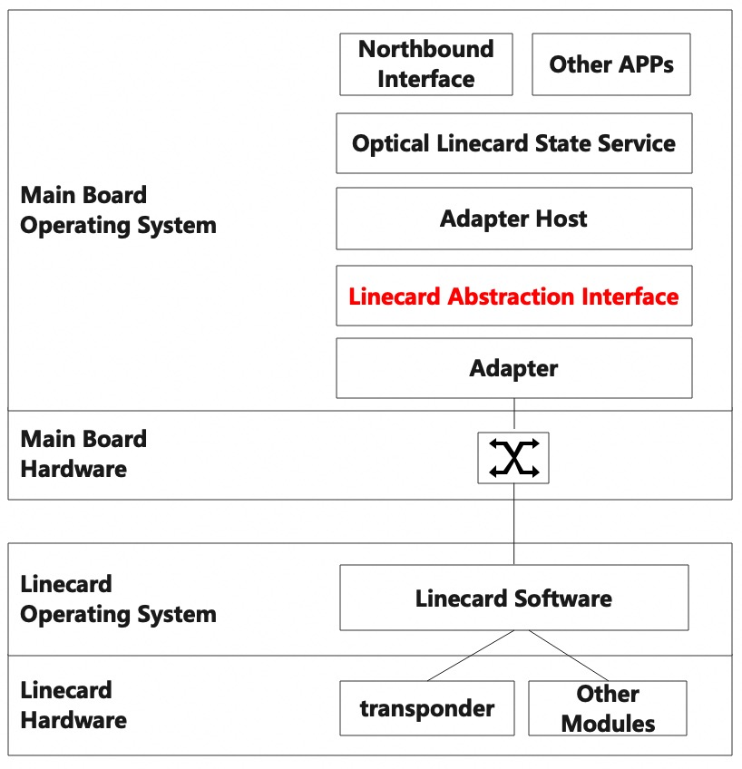

# Line-card Abstraction Interface(LAI)


A typical optical transport white-box contains one or two main boards and several line-cards.
In a such kind of box, LAI defines the APIs to provide a vendor-independent way of controlling and monitoring line-cards in a uniform manner.
LAI is based upon the Switch Abstraction Interface or SAI. This document will focus on the functions which are put forward by LAI.

## LAI Architecture



The adapter host and adapter are two terms form SAI. 
Adapter is a shared software library, supplied by a line-card vendor, that implements LAI Specification. It sets up a vendor-specific communication channel with the software that runs upon a line-card. 
Adapter host is a component that loads Adapter and exposes its functionalities to the Optical Line-card State Service module.
The optical line-card state service is a collection of software that provides a database interface for communication between northbound interface and line-card.

## LAI Interface
The adapter host begins using the adapter by invoking the _lai_api_initialize()_. This function allows the adapter to initialize various data structures for subsequent use. It has two parameters: _flags_, which is currently unused, and _services_. _services_ is a pointer to a structure of functions pointers which are provided by the adapter host. Currently, the adapter can call these functions to get its slot index. 
After initialization, the adapter host calls the function _lai_link_check()_ to check whether the communication channel between the adapter and the line-card software is established or not. Only when the channel is established, the adapter host reckons that line-card is active, and begins to manage the objects on the line-card through CRUD(Create/Read/Update/Delete) based APIs.
The _lai_api_query()_ can be used for retrieval of various methods tables for LAI functionalities.
The _lai_api_uninitialize()_ function is the inverse function to _lai_api_initialize()_ and is called by the adapter host before exiting.
## LAI Object
LAI defines a collection of APIs to create, delete, set, get attributes of LAI objects and to get statistics of LAI objects.
LAI objects are identified by using object ids. The adapter host calls create-API to create a specific LAI object. One or more key attributes are passed by the adapter host to the adapter during create function calls. The adapter uses these attributes to generate object ids. These object ids are returned after creation, and stored by the adapter host. When the adapter host calls delete, set or get API for a certain LAI object afterward, its object id should be passed to the adapter.
The line-card object is the top-level object, so when create, delete, set, get any others LAI objects, the line-card object id is needed.
## LAI Attribute
_lai_attribute_value_t_ enum defines the value types of the LAI attributes. _char chardata[512]_ defined in the _lai_attribute_value_t_ is used for all string type attributes. lai_double_t d64 is used for all decimal type attributes.
## LAI Statistic
The LAI statistic contains counters and gauges values. For instance, the total number of bad frames of a transceiver is a counter value, while the output power of a transceiver is a gauge value. _lai_stat_value_t_ enum defines the value types of the LAI statistics. _lai_uint64_t u64_ is used for all values whose base type is uint64_t. _lai_double_t d64_ is used for decimal type statistics.
## Status Code
LAI defines a list of return codes. Apart from the return codes which are from SAI, LAI defines several new return codes. When the adapter host operates an object whose admin status is up, the set function will fail and return _LAI_STATUS_ADMIN_IS_UP_; When the adapter host tries to get attributes of an object, but the adapter hasn’t received any data for this object, it will get a failure, and the return code will be _LAI_STATUS_OBJECT_NOT_READY_.
## LAI Metadata
LAI metadata is a set of validation checks, enhancements and auto generated data from LAI headers. The information could be used by adapter host and upper applications. 
The attributes with _MANDATORY_ON_CREATE_ flag are mandatory when calling create function; The attributes with _CREATE_AND_SET_ flag can be created, set and read. The attributes with _CREATE_ONLY_ can be created but cannot be modified by set function. The attributes with _READ_ONLY_ flag can only be read by get function; The attributes with _SET_ONLY_ flag can only be set by calling set function.
The attributes whose _isrecoverable_ tags are marked with _false_ will not be saved in local DB for reconciliations.
The _iscounter_ tag of a statistic indicates whether it is a counter or a gauge. If it is a counter, adapter will clear its value after being read by adapter host.
The unit tag of a statistics indicates its unit, and the _lai_stat_value_unit_t_ enum defines the possible units for statistical values.
For the statistic which is a double-precision floating values, the precision tag indicates the count of digits of its fractional component.
## Linecard Functionalities
Mandatory. The top-level object in LAI is the line-card object. It contains several line-card level functions such as line-card warm/cold reboot, line-card software upgrade, line-card pre-configuration, etc.
Currently, _LAI_LINECARD_ATTR_LINECARD_TYPE_ is the only one mandatory attribute to create a line-card object. Since different line-cards contain different components, the adapter initializes different data structures according to this attribute.
To warm/cold reboot line-card, use _LAI_LINECARD_ATTR_RESET_ attribute.
To deal with alarms on the line-card, the adapter host passes a callback function to the adapter when creating a line-card object via _LAI_LINECARD_ATTR_LINECARD_ALARM_NOTIFY_ attribute. When the line-card software reports alarms, the adapter calls this function to notify upper application.
To deal with the connection status with the line-card, a callback function is passed by the adapter host via _LAI_LINECARD_ATTR_LINECARD_STATE_CHANGE_NOTIFY_. When the adapter loses or re-establish the connection with the line-card, call this function to notify upper application.
The pre-configuration process is special for the line-card software. During a pre-configuration process, the port is configurable, even if it is not in the maintenance mode. To begin a pre-configuration process, use _LAI_LINECARD_ATTR_START_PRE_CONFIGURATION_ attribute. To stop this pre-configuration process, use _LAI_LINECARD_ATTR_STOP_PRE_CONFIGURATION_ attribute.
The line-card software upgrade is normally divided into three stages, namely, downloading, committing and rebooting. First downloading the software image from a certain path in the main board. Then installing the new software image. Finally, rebooting the line-card to reload the new software image. These processes are executed by the following attributes.

-  _LAI_LINECARD_ATTR_UPGRADE_DOWNLOAD_
- _LAI_LINECARD_ATTR_UPGRADE_COMMIT_
- _LAI_LINECARD_ATTR_UPGRADE_REBOOT_

Since the file transfer between the mainboard and the line-card may be based on the FTP or the SFTP protocol, the file name and its location, the ip address, a user account and its password of the mainboard are needed by the FTP (SFTP) server that works on the line-card. The information is passed to the line-card by the following attributes before executing a downloading command.

- _LAI_LINECARD_ATTR_HOST_IP_
- _LAI_LINECARD_ATTR_USER_NAME_
- _LAI_LINECARD_ATTR_USER_PASSWORD_
- _LAI_LINECARD_ATTR_UPGRADE_FILE_NAME_
- _LAI_LINECARD_ATTR_UPGRADE_FILE_PATH_
## Alarm Notification
When there is an alarm occurs (or disappears) on a line-card, the adapter uses
the alarm notification callback function which is passed by the adapter host by _LAI_LINECARD_ATTR_LINECARD_ALARM_NOTIFY_ attribute to notify upper application. The function is defined:
```
typedef void (*lai_linecard_alarm_notification_fn)(
    _In_ lai_object_id_t linecard_id,
    _In_ lai_alarm_type_t alarm_type,
    _In_ lai_alarm_info_t alarm_info);
```
The _lai_alarm_type_t_ enum contains all types of alarms. The _lai_alarm_info_t_ structure contains some detailed information, such as severity, source, created time, active or inactive.
